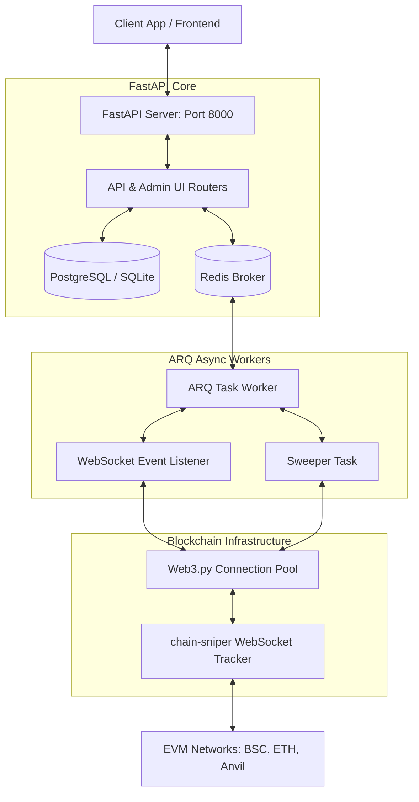
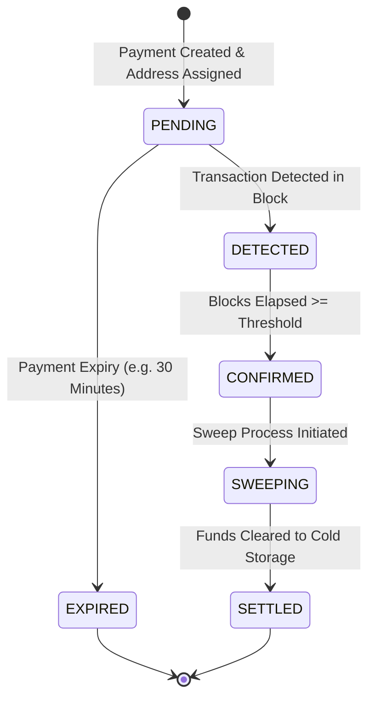

# Core Architecture

cTrip's high-performance architecture is designed for multi-chain scalability, security, and real-time response. It ensures that payment detection is fast, concurrent, and robust against network latency and transient blockchain disconnects.

---

## Architectural Blueprint

The application employs a highly decouple, async-first layered design:

---

## Layer Breakdown

### 1. The Async API Engine (`FastAPI`)
The API Layer serves merchant requests, generates unique HD wallet addresses, tracks payment lifecycles, and serves the **Admin Dashboard UI**. By relying entirely on `async/await` syntax, it maintains high-throughput and avoids blocking threads while executing database queries, calling Redis, or communicating with blockchain RPC nodes.

### 2. Multi-Chain Manager (`app/blockchain/manager.py`)
Rather than coupling the system to a single blockchain network, cTrip utilizes a general-purpose, object-oriented adapter pattern.
*   **The Config Map**: Network settings and native/ERC20 tokens are dynamically loaded from `chains.yaml` or fall back to an Anvil sandbox environment.
*   **Provider Instances**: A unified interface (`BlockchainBase`) encapsulates low-level `web3.py` client interactions like reading balances, compiling transactions, estimating gas, and broadcasting signed payloads.

### 3. Real-Time Detection Sniper
Instead of executing high-overhead HTTP block polling, cTrip adopts an event-driven blockchain notification system using `chain-sniper` over WebSockets:
*   **Active Listeners**: At worker startup, the application initializes permanent WebSocket listener tasks via `ScannerService.start_listeners()`.
*   **The Snipe Cycle**:
    *   `_on_block()` listens to incoming block headers and quickly snipes any native coin transfers to active payment addresses.
    *   `_on_log()` listens to contract events to filter out `Transfer` events corresponding to registered ERC20 token payments.
*   Upon detection, the payment status immediately moves to `DETECTED`.

### 4. Background Workers & Task Queue (`ARQ`)
Background tasks are processed outside of the API request/response cycle, relying on Redis for lightweight queueing:
*   **Continuous Cron**: An ARQ-driven loop runs every second to check if the blocks elapsed since `detected_in_block` meet the configured confirmation threshold. Once reached, payments transition to `CONFIRMED`.
*   **Sweeper Services**: Scans confirmed payments, checks address balances, computes gas fees, and consolidates (sweeps) merchant funds into secure, cold-storage administrative wallets.
*   **Webhook Dispatcher**: Signs payment events using HMAC-SHA256 and asynchronously relays webhook notifications to registered endpoints with robust retry mechanisms.

---

## Payment State Lifecycle

---

## Database Schema Highlights

The system leverages SQLAlchemy 2.0 mapped models:

*   **`Payment`**: Core record tracking chain, unique customer wallet address, expected amount, current status (`PENDING`, `DETECTED`, `CONFIRMED`, `EXPIRED`, `SETTLED`), detection block, and custom expiry timestamps.
*   **`Token`**: Configuration parameters of ERC20 contracts across supported networks (e.g. decimals, symbol, address, state).
*   **`HDWalletAddress`**: An registry logging indexes utilized from the BIP-44 hierarchical seed to guarantee unique address assignment per order and eliminate key conflicts.
